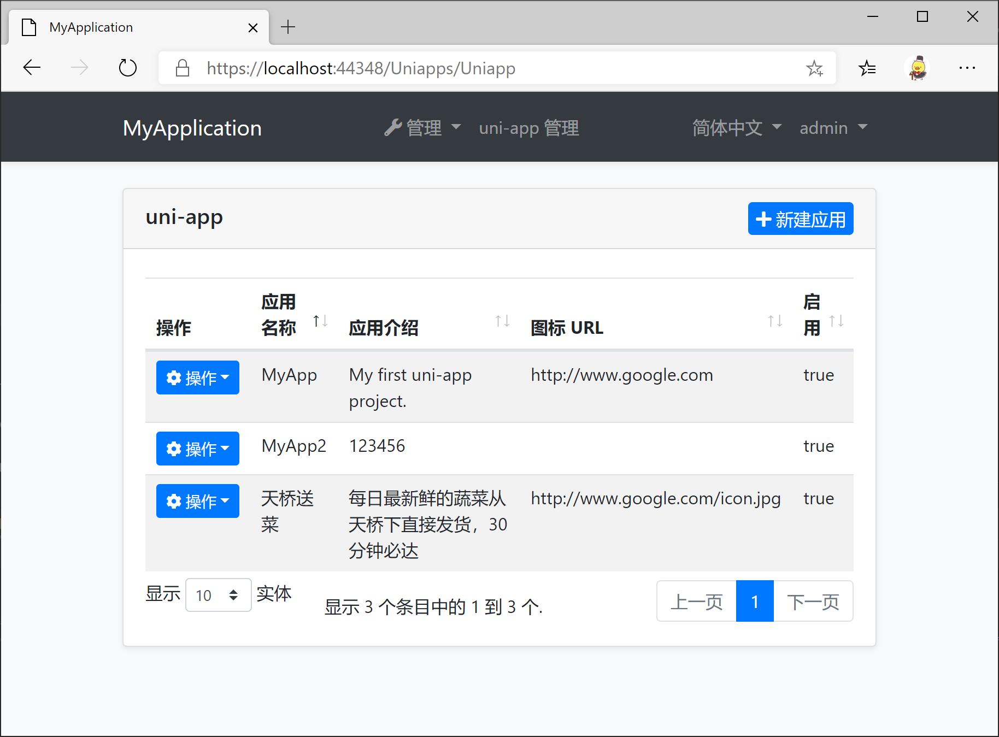
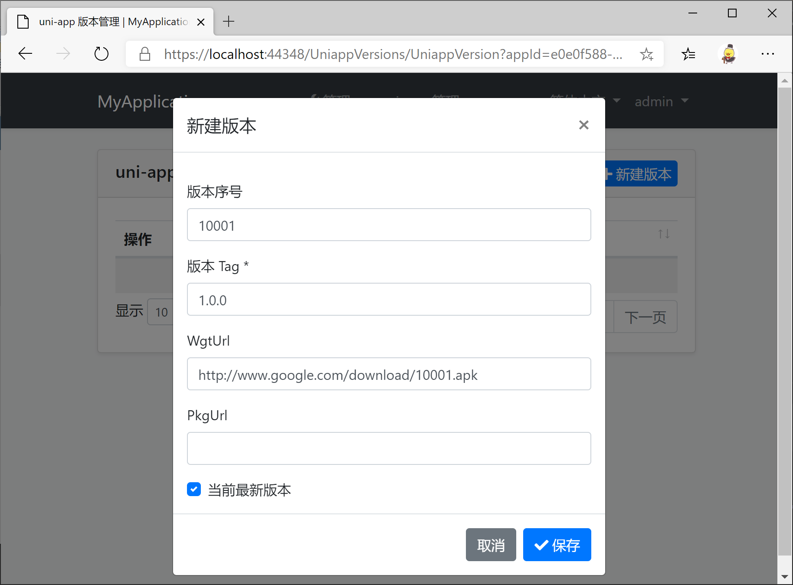
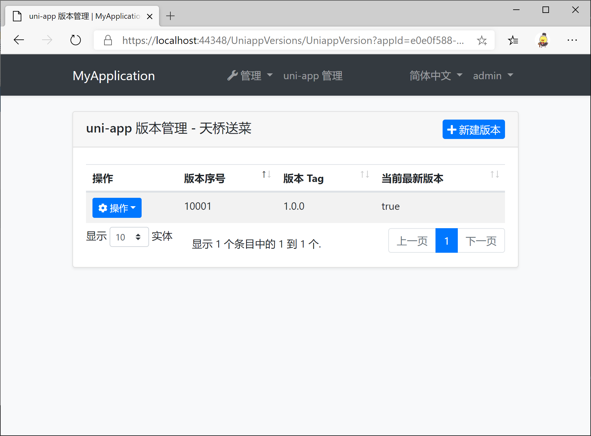
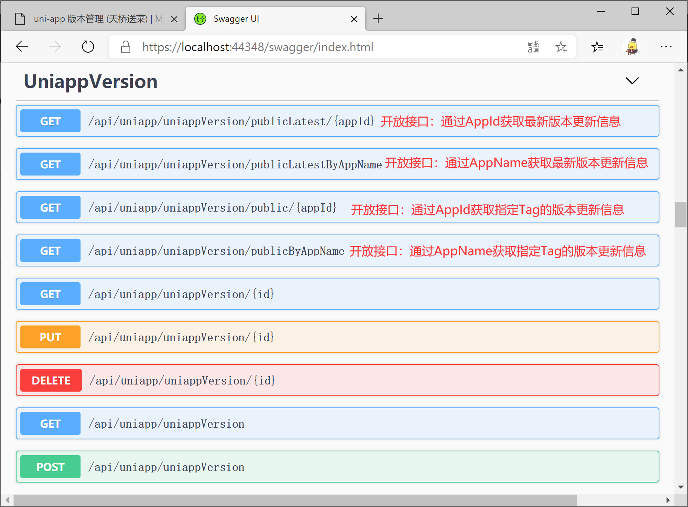

# UniappManagement
实现uni-app的应用版本管理、整包更新、热更新、差量热更新等功能的Abp应用模块

## Getting Started

* Install with [AbpHelper](https://github.com/EasyAbp/AbpHelper.GUI)

    Coming soon.

* Install Manually

    1. Install `EasyAbp.Abp.UniappManagement.Application` NuGet package to `MyProject.Application` project and add `[DependsOn(AbpUniappManagementApplicationModule)]` attribute to the module.

    1. Install `EasyAbp.Abp.UniappManagement.Application.Contracts` NuGet package to `MyProject.Application.Contracts` project and add `[DependsOn(AbpUniappManagementApplicationContractsModule)]` attribute to the module.

    1. Install `EasyAbp.Abp.UniappManagement.Domain` NuGet package to `MyProject.Domain` project and add `[DependsOn(AbpUniappManagementDomainModule)]` attribute to the module.

    1. Install `EasyAbp.Abp.UniappManagement.Domain.Shared` NuGet package to `MyProject.Domain.Shared` project and add `[DependsOn(AbpUniappManagementDomainSharedModule)]` attribute to the module.

    1. Install `EasyAbp.Abp.UniappManagement.EntityFrameworkCore` NuGet package to `MyProject.EntityFrameworkCore` project and add `[DependsOn(AbpUniappManagementEntityFrameworkCoreModule)]` attribute to the module.

    1. Install `EasyAbp.Abp.UniappManagement.HttpApi` NuGet package to `MyProject.HttpApi` project and add `[DependsOn(AbpUniappManagementHttpApiModule)]` attribute to the module.

    1. Install `EasyAbp.Abp.UniappManagement.HttpApi.Client` NuGet package to `MyProject.HttpApi.Client` project and add `[DependsOn(AbpUniappManagementHttpApiClientModule)]` attribute to the module.

    1. Install `EasyAbp.Abp.UniappManagement.MongoDB` NuGet package to `MyProject.MongoDB` project and add `[DependsOn(AbpUniappManagementMongoDbModule)]` attribute to the module.

    1. (Optional) If you need MVC UI, install `EasyAbp.Abp.UniappManagement.Web` NuGet package to `MyProject.Web` project and add `[DependsOn(AbpUniappManagementHttpApiModule)]` attribute to the module.
    
    1. Add `options.ConventionalControllers.Create(typeof(UniappManagementApplicationModule).Assembly);` to `Configure<AbpAspNetCoreMvcOptions>(options => { ... });` in your host module (It is usually Web project or HttpApi.Host project).

    1. Add `builder.ConfigureUniappManagement();` after `builder.ConfigureMyProject();` to `MyProjectMigrationsDbContext.cs`.

    1. Add EF Core migrations and update your database. See: [ABP document](https://docs.abp.io/en/abp/latest/Tutorials/Part-1?UI=MVC#add-new-migration-update-the-database).

## Usage

1. Add permissions to the roles you want.

1. Enjoy this wonderful module.

## Roadmap

- [ ] Add cache.
- [ ] Unit tests.
